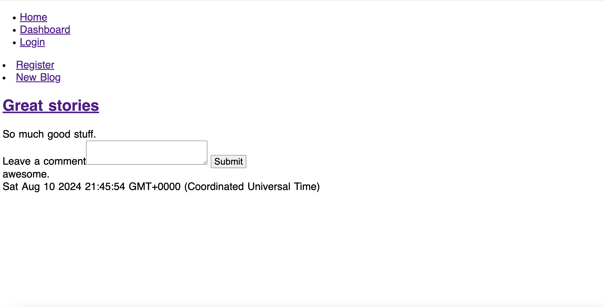

# Sunset Blog Posts
  
  
## Description
My motivation to create this project was to make a to create a blog website for users to create blogs and post comments on the blogs. I built this project to create a platform for users to create logins, write blog posts, and write comments on the posts. This application solves the problem of not having a blog posting app. I learned how to use the MVC for this application.

## Deployed Site

Here is a link to the deployed website: https://sunset-blog-posts.onrender.com

## Installation

To install the project, pull the code from https://github.com/stefanfilm/sunsetblogposts and open it in a code editor. Go to www.onrender.com and create a database. Then, create a new webservice. Follow the prompts and generate the deployed site. 

## Usage

Navigate to the website and click "Register". Enter an email and password. Click on "New Blog". Enter in a blog title and blog text. Click on the blog. Leave a comment. Navigate back to the blog and see your comment. 

    ```md
    
    ```


  ## License
  This project is licensed with the MIT license.
  

  ## Contributions
  Self. This project was made under the instruction of Mark Carlson in the UC Berkeley Software Development Bootcamp.

  ## Questions
  You can contact me at stefan.wanigatunga@gmail.com
  My GitHub Username is stefanfilm